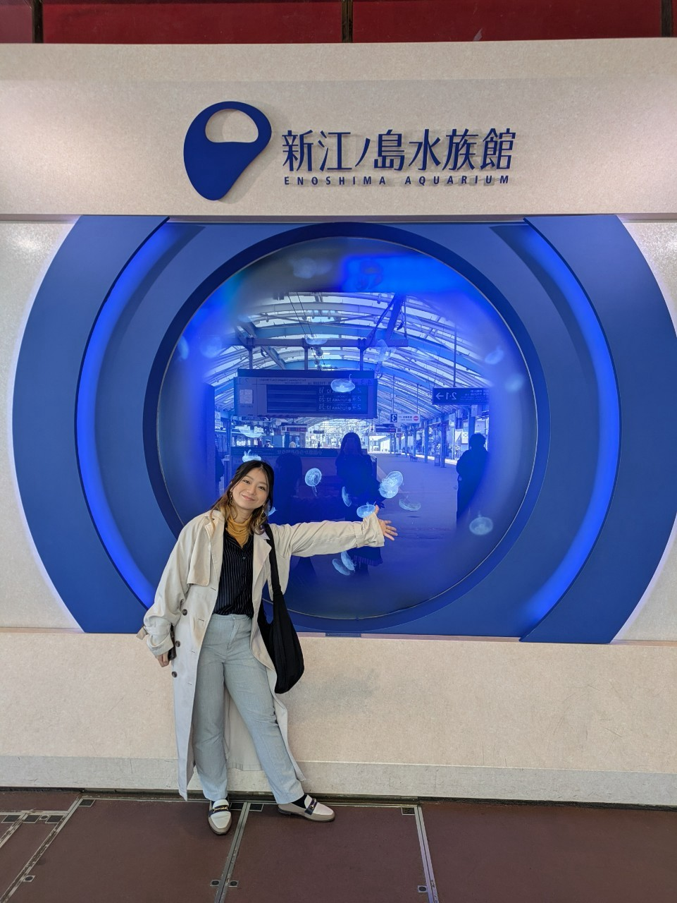
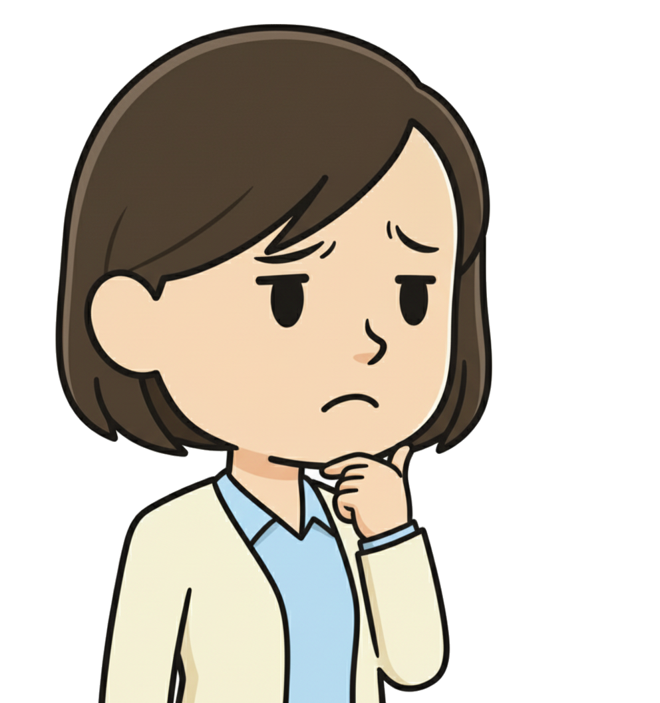
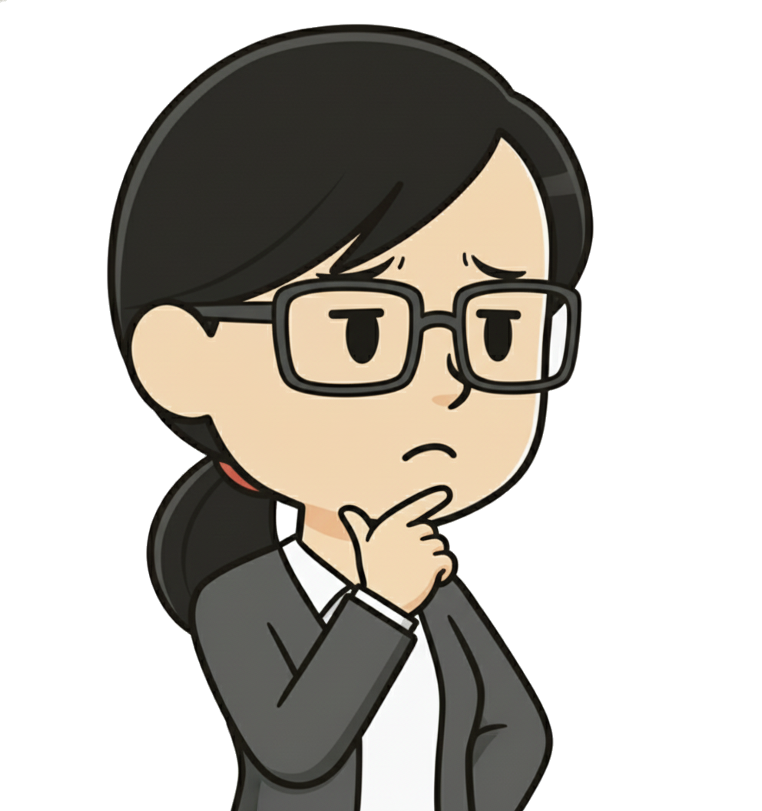

<!-- ▼ ▼ ▼ ▼ ▼ ▼ ▼ ▼ ▼ ▼ ▼ 以下スライド ▼ ▼ ▼ ▼ ▼ ▼ ▼ ▼ ▼ ▼ ▼ -->

<!-- タイトルスライド -->
<!-- _class: title -->
<!-- _paginate: false -->

生プロ業務紹介（木戸）

～現場物流へのデジタル情報活用による効率化手法開発～

---

<!-- _class: v-center -->

## 目次

- P.03 [自己紹介](#slide-intro)
- P.04 [この紹介のゴール](#slide-goals)
- P.05 [生プロミッション](#slide-mission)
- P.06 [私の担当業務](#slide-mywork)
- P.07 [私の担当業務（実態）](#slide-mywork-real)
- P.08 [私の担当業務（続き）](#slide-mywork-cont)
- P.09 [なぜこの仕事に取り組むか](#slide-why)
- P.10 [なぜ「モノ」から着手するか](#slide-why-material)

- P.11 [なぜ予定が変わったのか？](#slide-actions)
- P.12 [仕事の進め方 - 最も重要だと思うこと](#slide-workstyle)
- P.13 [思考のフレームワーク](#slide-framework)
- P.14 [良い計画の構成要素](#slide-planning)
- P.15 [経験から学んだこと](#slide-experience)
- P.16 [MBOとの関連](#slide-mbo)
- P.17 [ここから得た教訓](#slide-lessons)
- P.18 [新入社員へのメッセージ](#slide-message)
- P.19 [Tips - 生成AI活用](#slide-ai-tips)
- P.20 [生成AI活用の注意点](#slide-ai-caution)

---

## 自己紹介

<a href="#slide-toc">目次に戻る</a>

<!-- 左カラム：基本情報 -->

- **名前**: 木戸　優花
- **入社年**: 2024年8月入社
- **経歴**:
  - 2020年3月: 東京農工大学　工学部　応用分子化学科卒業
  - 2020年4月: 住友電工へ入社
    - 所属: 半導体事業部　インジウム燐（InP）基板部門　結晶生産技術部
    - 業務: InP結晶の生産性向上（生産手法・加工手法開発等）
  - 2024年8月: 住友電工から荏原製作所へ転職
- **趣味・興味**:
  - 展示会巡り
  - 謎解きイベント参加
  - 生成AIの業務活用

<!-- 右カラム：画像と吹き出し -->

<!-- 画像 -->

<!-- 吹き出し -->

これからよろしくお願いします！

---

<!-- _class: v-center -->

## この紹介のゴール

<a href="#slide-toc">目次に戻る</a>

<h3>1. 課題解決の窓口を知る</h3>

何か知りたくなったときの相談相手選びに使ってほしい

<ul style="font-size: 16px; margin: 0; padding-left: 20px;">
<li><strong>最初</strong>: 「分からないことがあるが、誰に聞けばいいか分からない…」</li>
<li><strong>紹介後</strong>: 「この人はこんなことを知っている」と何となく理解</li>
<li><strong>期待する行動</strong>: 業務で疑問やアイデアが浮かんだら気兼ねなく訊いてみる</li>
</ul>

<h3>2. 働き方をイメージする</h3>

色んな仕事の進め方を知り、自分の業務の参考にする

<ul style="font-size: 16px; margin: 0; padding-left: 20px;">
<li><strong>最初</strong>: 「そもそも仕事ってどう進めればいいのか…」</li>
<li><strong>紹介後</strong>: 仕事の進め方の一例をざっくり理解</li>
<li><strong>期待する行動</strong>: Why→What→Howの順で考える、計画要素を意識する、生成AIを活用する</li>
</ul>

<h3>3. テーマアップの参考</h3>

「自分は何をやりたいんだろう」と思い始める

<ul style="font-size: 16px; margin: 0; padding-left: 20px;">
<li><strong>最初</strong>: 「やってみたいこととか言われても分からない…」</li>
<li><strong>紹介後</strong>: 「なぜ？」「こうできないか？」から自分のテーマが生まれるときがあると知る</li>
<li><strong>期待する行動</strong>: 日々の業務の中で課題を見つけようとする心持ちになる</li>
</ul>

---

## 前提: （私の考える）生プロミッション

<a href="#slide-toc">目次に戻る</a>

### 部のミッション = 生産革新 = 工場の「ムダ」をなくすこと

#### 課のミッション（ざっくり）

**= 生産革新活動の推進方針策定と統括、および各活動の計画・実行支援**

主な取り組み:
- 生産革新施策の実施・検証・フィードバック
- DX化・AI・データ活用による成果創出
- 活動・拠点の情報整理と共有化
- 人材の教育・育成

**参考**: [荏原の生産革新活動（2025年版）](https://docs.google.com/presentation/d/12ZCMxQJY2f_fv5XtTkVlVjvqniUFVfne/edit?usp=drive_link&ouid=101503088366828710194&rtpof=true&sd=true)P7  
**補足**: 詳細は[BA0031：職務分掌規程（コーポレート等）.pdfのP59](https://ebara.ent.box.com/file/1735820519558#p=26)参照

---

<!-- _class: v-center -->

## 私の担当業務

<a href="#slide-toc">目次に戻る</a>

<h3>担当業務：「構内物流の改善」</h3>

→ 「モノの滞留」という課題を解決する 
タイトル：「現場物流へのデジタル情報活用による効率化手法開発」

---

<!-- _class: v-center -->

## 私の担当業務（実態）

<a href="#slide-toc">目次に戻る</a>

<!-- 上段: 新入社員の質問（左寄せ） -->

  

    <!-- 新入社員アイコン -->
    
  

  

    では現在、"デジタル情報活用"によって効率化する手法を開発しているんですか？
  

<!-- 下段: 回答（私、左寄せ） -->

  

    <!-- 私のアイコン -->
    
  

  

    <strong>していません！！！</strong>
  

---

## 私の担当業務（続き）

<a href="#slide-toc">目次に戻る</a>

  <!-- 左: 01 -->
  

    

      
01

      
あるべき姿の具体化

      

        <ul style="font-size: 18px; margin: 0; padding-left: 20px;">
          <li>JITに基づき、モノの流れのあるべき姿を定義</li>
          <li>改善手法、ロードマップの体系化</li>
        </ul>
      

    

  

  <!-- 中央: 矢印（上→上の02、下→下の02） -->
  

    <!-- 絵文字矢印（上右 / 下右） -->
    
　

    
↘️

  

  <!-- 右: 02 上下 -->
  

    <!-- 02 上: 旧予定 -->
    

      
02

      
具体的なツール開発（旧予定）

      

        <ul style="font-size: 18px; margin: 0; padding-left: 20px;">
          <li>改善対象の選定</li>
          <li>ツール導入による効率化</li>
          <li>現場向け試作・PoCの実施</li>
          →上司判断で中止
        </ul>
      

    

    <!-- 02 下: 現在 -->
    

      
02

      
仕組みづくり（現在）

      

        <ul style="font-size: 18px; margin: 0; padding-left: 20px;">
          <li><strong>全社的な評価・管理の仕組み構築</strong>　←今ココ</li>
          ＝EGMサーベイに新しく物流の項目を構築 
（資料参照：<a href="https://drive.google.com/drive/folders/1YMmR3_aoJjjjNH6ebf2rUR8qaQ0Q6iMc?usp=sharing" target="_blank">EGMサーベイの導入・拡大の業務紹介</a>）
          <li>仕組みを用いた滞留箇所の特定と改善提案（予定）</li>
        </ul>
      

    

  

---

## なぜこの仕事に取り組んでいるのか？

<a href="#slide-toc">目次に戻る</a>

### きっかけ

研修で工場を見学した時、**モノが積みあがったまま放置されている様子**に課題を感じた

<!-- アイコン画像 -->

<!-- 吹き出し -->

「なぜこんなに仕掛品が溜まっているのだろう？」

「これを改善できないか？」

→ この疑問が、今の担当業務につながっている

---

## なぜ「モノ」から着手するのか？

<a href="#slide-toc">目次に戻る</a>

### 改善の優先順位に関するセオリー（※自論）

#### 前提1：製造現場を構成する4M

改善対象を考える際のフレームワーク

- **Man（人）**: 作業者のスキルや動き
- **Machine（機械）**: 設備の性能や稼働
- **Material（材料）**: モノの流れや在庫
- **Method（方法）**: 作業手順やプロセス

→ この4つの要素のうち、まず「Material（モノ）」から着手する

#### 前提2：製造現場における7つのムダ

1. **造りすぎのムダ**: 需要を超えた生産
2. **在庫のムダ**: 原料・仕掛品・製品の過剰な滞留
3. **手待ちのムダ**: 待ち時間や手持ち
4. **運搬のムダ**: 不要な移動や運搬
5. **動作のムダ**: 不要な動きや非効率な作業
6. **加工のムダ**: 必要以上の加工や過剰品質
7. **不良・手直しのムダ**: 品質不良による再作業

生産性向上 = 付加価値を生まない「ムダな時間」の排除

---

<!-- _class: v-center -->

## なぜ予定が変わったのか？

<a href="#slide-toc">目次に戻る</a>

<h3>簡単にまとめると</h3>
<ul style="font-size:20px; margin: 0; padding-left: 22px;">
  <li>部長の判断により、個別ツールより仕組み化に資源を投入する決定がなされた</li>
  <li>そのため、当初のツール開発から評価・管理の仕組みづくりへ軸足を移した</li>
</ul>

---

## 仕事の進め方 - 最も重要だと思うこと

<a href="#slide-toc">目次に戻る</a>

「良い計画」が全てを決める

<h3>最も重要なこと</h3>

最終形の解像度をいかに高めるか

<li>最終形から逆算してロードマップを作る</li>
<li>各フェーズで何を決めるか考える</li>
<li>決まったこと次第で 　  後の動きが変わるか検討する</li>

<h3>計画が曖昧なまま決めると...</h3>
<ul style="font-size: 24px; margin: 0; padding-left: 24px;">
<li>ゴールがブレる</li>
<li>関係者の理解が得られない</li>
<li>スケジュールが予定から大幅に変わる</li>
<li>手戻りが発生する</li>
</ul>

---

## 思考のフレームワーク

<a href="#slide-toc">目次に戻る</a>

<h3>Why → What → How で考える</h3>

この順番で考えると良い

01

Why

なぜこれをやるのか？ 
（目的・背景）

02

What

何をするのか？ 
（スコープ・成果物）

03

How

どうやるのか？ 
（手段・方法）

この順番を守ることで、ブレない計画が立てられる

---

## 良い計画の構成要素

<a href="#slide-toc">目次に戻る</a>

<h3>必須項目</h3>

- **背景**: なぜこの取り組みが必要なのか？
- **目的(Why)**: 何を達成したいのか？
- **スコープ**: どこまでやるのか？何をやらないのか？
- **関係者と権限**: 誰が何を決めるのか？
- **スケジュール**: いつまでに何をするのか？
- **リスク**: 想定される障害は何か？

---

## 経験から学んだこと

<a href="#slide-toc">目次に戻る</a>

### 計画通りにいかない現実

#### 実体験：方針変更

<h3>当初の計画</h3>

ツール導入による効率化

→

<h3>実際</h3>

全社的な仕組み作りに方針変更

#### 変更の原因

- 他テーマと同じ進め方になると勝手に判断した
  - そのつもりで先々の予定を立ててしまった
  →　MBOもそれで組んでしまったので、評価にダイレクトに影響が……

---

## MBOとの関連

<a href="#slide-toc">目次に戻る</a>

### 目標設定と評価の難しさ

#### MBO（目標管理制度）との関係

- 期初に立てた目標が、途中で変更になることもある
- 評価との兼ね合いで悩むことも...

<!-- アイコン画像 -->
  

  
  

  <!-- 吹き出し -->
  

    

      仕様変更は計画の甘さと評価されてしまう…？
    

    

      妥当な仕様変更とそうでないものの違いは何だろう…？
    

  

  

    → この葛藤自体が教訓となっている
  

---

<!-- _class: v-center -->

## ここから得た教訓

<a href="#slide-toc">目次に戻る</a>

  

    <h3>1. 初期計画の重要性</h3>
    

    最初の計画がしっかり検討できていれば、変更にも対応しやすい 
    ※"しっかり"＝先々まで決めること　ではなく、 
    　計画の判断基準を明確にし、確証を得ること 
    　例）次のフェーズへ進む際に合意を得る相手は誰か？ 
    　例）合意を得る際の判断材料や基準は何か？
    

  

  

    <h3>2. 全体の方針を常に意識</h3>
    

    自分の担当だけでなく、会社全体の方向性を見る 
    上位の意思決定に敏感になる
    

  

---

<!-- _class: v-center -->

## 新入社員へのメッセージ

<a href="#slide-toc">目次に戻る</a>

### 自身の「テーマ」を見つけるために

<h3>最初は指示通りで大丈夫</h3>
<ul style="font-size: 20px; margin: 0; padding-left: 24px;">
<li>まずは言われたことを確実にこなす</li>
<li>その中で「なぜ？」「どうして？」を考える</li>
</ul>

<h3>そのうち「こうしたい」が芽生える</h3>
<ul style="font-size: 20px; margin: 0; padding-left: 24px;">
<li>「もっとこうした方がいいのでは？」</li>
<li>「こんなことに挑戦してみたい」</li>
</ul>

---

## Tips - 生成AIを活用しよう！

<a href="#slide-toc">目次に戻る</a>

### 生成AIを積極的に活用しよう

<h3>私の活用例</h3>
<ul style="font-size: 20px; margin: 0; padding-left: 24px;">
<li>資料作成</li>
<li>議事録やアジェンダの整理・要約</li>
<li>アイデア出し、考えの構造化</li>
<li>業務全体のAI化</li>
<li>新しい技術の調査、学習</li>
</ul>

<h3>特に便利な使い方</h3>

「壁打ち相手」として優秀

<ul style="font-size: 20px; margin: 0; padding-left: 24px;">
<li>考えを整理したい時</li>
<li>異なる視点が欲しい時</li>
<li>言語化が難しい時</li>
</ul>

実際にこの資料も、生成AIと対話しながら作成しています！

---

<!-- _class: v-center -->

## 生成AI活用の注意点

<a href="#slide-toc">目次に戻る</a>

<h3>注意点: AI出力をそのまま使わない</h3>

<h3>重要なこと</h3>
<ul style="font-size: 20px; margin: 0; padding-left: 24px;">
<li>自分の言葉で再構成する</li>
<li>内容を理解してから使う</li>
<li>最終的な責任は自分にある</li>
</ul>

<h3>参考情報</h3>
<ul style="font-size: 20px; margin: 0; padding-left: 24px;">
<li><a href="https://docs.google.com/presentation/d/1H5nKFOPRgblZL55KrhXm2bh08Sa92ONSZo1LnJvcX7I/edit?usp=sharing" target="_blank">生成AI利活用ガイドライン</a></li>
<li><a href="https://ebara.ba.accelatech.com/content/38762?ts=1761010867142" target="_blank">生成AI仕事術ラボ</a></li>
</ul>

---

<!-- クロージングスライド -->
<!-- _class: closing -->
<!-- _paginate: false -->

---

<!-- _class: v-center -->

## APPENDIX

<h3 style="font-size: 32px; margin-bottom: 30px;">期中報告スライド</h3>

より詳細な業務内容については、 
以下の期中報告スライドをご参照ください！

<a href="https://drive.google.com/file/d/18LXPswZeLVYgex-9xbbqiwFCiCJsiqfp/view?usp=sharing" target="_blank" style="font-size: 26px; font-weight: bold; color: #4472C4; text-decoration: underline;">
📄 期中報告スライドを開く
</a>

