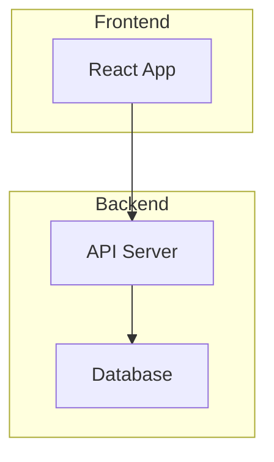
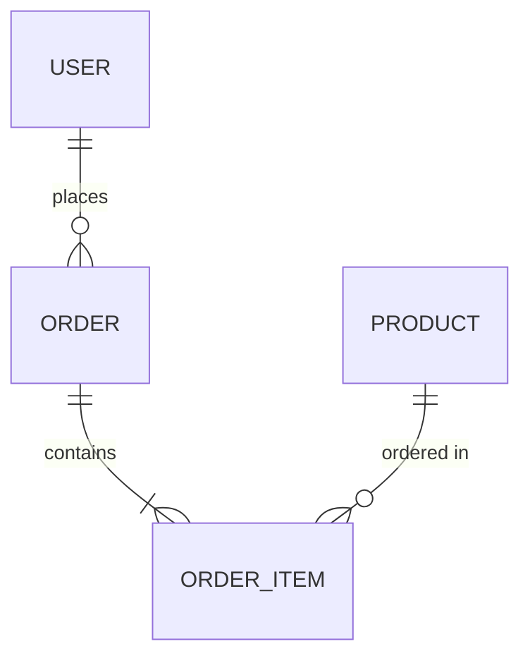

# 私が始めたAI協働生活 〜失敗から学んだ仕様駆動とサブエージェント連携〜

## はじめに

2025年は私にとって生成AIとの向き合い方が大きく変わった年でした。
「質問する」「コードを生成してもらう」チャット型から、「タスクを任せる」「一緒に作業する」エージェント型へ。単なるツールのアップデートではなく、働き方そのものが変わる転機でした。
本記事では、2025年6月から本格的に始めた生成AIとの試行錯誤を通じて得た実体験を共有します。
この約半年間の振り返りとして、生成AIとの向き合い方の変化から生成AIエージェントチーム開発での失敗、そこから生まれた「仕様駆動開発」、そして最終的にたどり着いた「サブエージェント連携システム」まで、失敗も成功もすべて包み隠さずお伝えします😊
この記事を読むと、こんなことが分かります :

- 💥 生成AIエージェントチーム開発の失敗談（tmux爆死と応援団問題）
- 📋 失敗から生まれた仕様駆動開発（ドキュメント化で解決）
- 🤖 サブエージェント連携システムの構築（16種類の専門家との協働）
- 🚀 実践的な成果（開発アウトプットをほぼ100%AI生成）
- 🤝 今日から始める6つのポイント（小さく始めて、ルールを育てる）

アドベントカレンダー最終日ということで、半年間の試行錯誤を振り返っていたら大ボリュームになってしまいました…！コーヒー片手にゆっくりお読みください☕

## 転機：エージェント型AIの登場

### 私の生成AI活用タイムライン（2025年）

### チャット型からエージェント型へ

2024年から生成AIを使ってはいましたが、2025年6月上旬、社内でAmazon Q Developer CLIの利用が始まったことをきっかけに、私の本格的な生成AI活用が始まりました。
使用ツール :

- Amazon Q Developer CLI - 会社・プライベート両方で使用
- Gemini CLI - 主にプライベートで使用

それまでは「コーディング支援ツール」として使っていました。

- 「この関数を書いて」
- 「このエラーを解決して」
- 「このコードをレビューして」

典型的なチャット型の使い方です。
でも、6月に入ってCLIを使い込んでいくうちに、生成AIは単なる補完や質問応答ではなく、実際に作業を進めてくれることに気づきました。
具体例 :

- 「この機能を実装して」→ コード生成からテストまで
- 「このバグを修正して」→ 原因調査から修正まで
- 「SSH接続がうまくいかない」→ 環境調査から問題解消まで
- 「CodeDeployでエラーが出てる」→ ログ調査から原因特定・対応まで
- 「このGitHubプロジェクトのサマリー作って」→ コードベース全体を分析して、構造・技術・目的を整理

### 向き合い方の変化

この時点で、生成AIとの向き合い方が大きく変わりました。

チャット型の特徴 :

- 質問 → 回答の繰り返し
- 同期的なコミュニケーション
- 単発のタスク処理

エージェント型の特徴 :

- タスク依頼 → 作業実行 → 成果物
- 非同期的なコミュニケーション
- 継続的なタスク処理

そこで、私はこう思いました。
「もしかして...生成AIのチームを作ったら、生産性爆上がりするんじゃない？💡」
そして、この「エージェント型」の可能性を模索するため、私は実験を始めることにしました。
それが、生成AIエージェントチームの構築です。

## 第一の試行錯誤：生成AIエージェントチームの構築

### 実験の始まり

生成AIエージェントチームの構築を実現するため、私はこの記事を参考に実験を始めました。

tmuxでClaude CodeのMaxプランでAI組織を動かし放題のローカル環境ができた〜〜〜！ので、やり方をシェア！！🔥🔥🔥🙌

※ tmux ：ターミナルマルチプレクサ（複数の仮想端末を管理するツール）。画面を複数のペイン（画面分割単位）に分割して、それぞれで異なる作業を同時に進められる。

### tmuxでのAIエージェントチーム開発の仕組み

tmuxで複数のペインを作り、それぞれに役割を割り当てました。
構成 :

- ペイン1: PM（プロジェクトマネージャー）
- ペイン2: TL（テックリード）
- ペイン3: Engineer1（UI/UX担当）
- ペイン4: Engineer2（バックエンド担当）
- ペイン5: Engineer3（品質管理担当）

アーキテクチャ :

通信フロー :

- 人間 → PM: 「ホームページを作って」
- PM → TL: ビジョンと成功基準を伝達
- TL → Engineer1,2,3: タスクを分解して割り振り
- Engineer1,2,3: 並列で作業実行
- Engineer1,2,3 → TL: 完了報告
- TL → PM: 統合結果を報告
- PM → 人間: 成果物を提示

メッセージ送信の仕組み :
核心部分はtmuxのsend-keysコマンドです。

```bash
# 1. 現在の入力をクリア（Ctrl+C）
tmux send-keys -t " $target " C-c

# 2. メッセージテキストを送信
tmux send-keys -t " $target " " $message " 

# 3. Enterキーを送信（実行）
tmux send-keys -t " $target " C-m
```

使用例: `./agent-send.sh TL "タスクを開始して"`
つまり、「人間がターミナルでタイピングする動作」をプログラムで再現しているだけで、特別なAPIやプロトコルは使っていません。シンプルですが効果的な仕組みです。

複数のAIがそれぞれのペインで同時に作業する様子を見て、「めっちゃ楽しい！！」「これは未来だ！！」と高揚感でいっぱいでした✨

### 直面した問題

想定していたのは、「私 ⇔ PM」のやり取りだけで、あとは「PM ⇔ TL」「TL ⇔ 各Engineer」のやり取りが自動的に進む、という形でした。
でも、現実はそう甘くありませんでした。

- 問題1: メッセージ送信の破綻
  - PMがTLにメッセージを送っても、TLが返信しない
  - TLがEngineerに指示を出しても、Engineerが別の話題で返信
  - 私が各ペインを行き来して、手動でメッセージをコピー＆ペースト

結果、私がメッセンジャーになってしまいました。
「伝書鳩じゃないんだから…😤」

- 問題2: tmuxペインの固まり
  作業開始からしばらくすると、ペインが固まり始めました。
  「あれ？応答がない...」
  リペインして、要件や進捗状況を再伝達。でも、またしばらくすると固まる。この繰り返し。
  実際の作業時間よりも、状況説明に費やす時間の方が長いという本末転倒な状況に。
  「一体何やってんだろ…😮‍💨」

- 問題3: 作業ディレクトリの迷子
  コンテキストオーバーフローで記憶を失ったEngineerが、突然プロジェクトディレクトリとは全く関係ない場所（ワークディレクトリ直下など）で作業を始める...
  ※ コンテキストオーバーフロー ：AIが処理できる情報量（コンテキストウィンドウ）の上限を超え、過去の会話内容を忘れてしまう現象。長い会話を続けると、初期の指示や文脈が失われることがある。
  「なんでそこにファイル作ってるの...？😨」

- 問題4: CLIエラー祭り
  当時のAmazon Q Developer CLIは、頻繁にエラーが発生しました。
  サーバーエラー、モデル利用不可、認証エラー、UTF-8エラー...
  しばらくして確認すると、エラーで作業が止まっている。
  「これじゃあ、開発どころじゃないじゃん…😩」

- 問題5: 会話の上書き
  複数メンバーが同時に質問・相談してくると、先に質問していた人のものがスルーされてしまいます。
  「じゃあ、チーム人数を減らせばいいんじゃね？」
  3人にしても同じ。
  2人にしても、結局1人だけが作業して、残りは…
  「頑張って！」
  「いいね！」
  「その調子！」
  …応援してるだけ。
  応援団かよっ！📣
  しかも、この余計な会話のやり取りでタスクが一向に進まない。応援メッセージでコンテキストを無駄に消費していく…。
  「実用的じゃない…😓」

- 問題6: 利用上限とコンテキストオーバーフロー
  こうした問題を抱えながら数日実験を続けると、当月分の利用上限に到達してしまいました。
  さらに、コンテキストウィンドウもオーバーフロー。都度、要件・進捗を伝え直す必要がありました。
  ※ コンテキストウィンドウ ：AIが一度に処理できる情報量の上限。この範囲内の情報のみを参照して回答を生成するため、上限を超えた古い情報は考慮されなくなる。
  しかも、伝え直すたびに微妙にアウトプットがブレる。
  「AIエージェントチーム開発、まだ早すぎたか…😞」

## 第二の試行錯誤：仕様駆動開発の誕生

AIエージェントチーム開発の失敗から、私は重要な気づきを得ました。
「もしかして...ドキュメント化すればいいんじゃない？💡」

### ウォーターフォール型の発想

2025年6月末、私は新しいアプローチを試すことにしました。
何十回とテストプロジェクトを実施し、チームで振り返りを繰り返しながら、作業ステップごとにドキュメント化していきました。
その過程の中で、私はあることに気づきました。
「もしかして...ウォーターフォール開発の工程に沿えば、ブレなくできるんじゃない？💡」
※ ウォーターフォール開発 ：要件定義→設計→実装→テスト→運用という順序で進める伝統的な開発手法。各工程を順番に完了させてから次に進むことで、作業の明確化と品質管理を実現する。

### 仕様駆動開発ルールの確立

こうして生まれたのが、当初「ウォーターフォール開発ルール」と呼んでいたもの。後に「仕様駆動開発」と名付けることになります✨
今では「仕様駆動開発」という考え方は一般的になりつつありますが、これは当時の試行錯誤から生まれた私なりの解決策でした。

### 仕様駆動開発（SDD）とは

仕様駆動開発（SDD: Spec-Driven Development）は、「何を作るか（What）」を仕様書で明確に定義し、それを唯一の情報源として「どう作るか（How）」をAIに任せる手法です。
従来の開発手法との違いを簡単にまとめると、

- テスト駆動開発（TDD） : テストを先に書き、そのテストが通るようにコードを実装する。「テストがドキュメント」という考え方
- アジャイル開発 : 動くコードを素早く作り、フィードバックを受けながら仕様を調整していく。変化への対応を重視
- 仕様駆動開発（SDD） : 仕様を先に書き、それを唯一の情報源（Single Source of Truth）として設計・実装・テストを進める。AIエージェントとの協働に適している

### なぜAIエージェントとの協働で有効なのか

生成AIエージェントには以下の特性があります。

- コンテキストウィンドウの制限 - 一度に処理できる情報量の上限がある
- セッション間の記憶がない - 新しい会話では過去の文脈を忘れている
- 曖昧な指示への解釈ブレ - 同じ指示でも毎回微妙に異なる解釈をする

仕様書を「唯一の情報源」として用意しておくことで、これらの問題に対応できます。

- ✅ コンテキスト制限 → 必要な情報を仕様書にまとめて毎回渡せる
- ✅ 記憶がない → 新しいセッションでも仕様書を読めば同じ文脈で再開できる
- ✅ 解釈ブレ → 仕様書という基準があるのでズレを検知・修正しやすい

### 開発フロー

最初は、要件定義→設計→実装という流れだけを定義していました。しかし、AIの自由な発想で一気に進んでしまい、依然としてブレが生じていました。
そこで、各フェーズごとに承認ゲートを設け、人間が確認してから次に進む形に改善しました。

フローの詳細 :

- 要件定義 : 何を作るかを明確化（requirements.md）
- 承認 : 内容を確認・承認
- 技術設計 : どう作るかを設計（design.md）
- 承認 : 設計内容を確認・承認
- 計画立案 : タスク分解・工数見積（tasks.md）
- 承認 : 計画を確認・承認
- 実装着手 : 実際のコーディング開始

メリット :

- 途中でコンテキストがオーバーフローしても、ドキュメントから続きを再開可能 📄
- 各フェーズで承認を挟むことで、アウトプットのブレが大幅に減少 ✅
- 作業の透明性・再現性の向上 🔍
- 「何をすべきか」が明確なので、AIも迷わない 🎯

### 仕様駆動開発ルール（基本原則の抜粋）

# 仕様駆動開発（Specification Driven Development）フロー

この文書は、AIエージェントとユーザーとの共同作業における、柔軟かつ堅牢な開発プロセスを定義します。

## 0. 基本原則

### 0.1. 承認ベースの進行
各フェーズは、指定された成果物に対するユーザーの**承認**を以て次へと進みます。

### 0.2. プロジェクトルールの遵守
いかなる作業に着手する前も、まず対象プロジェクトの`README.md`や関連ドキュメントを読み、既存のブランチ戦略、コーディング規約、その他のローカルルールを最大限尊重し、遵守します。

### 0.3. プロセスの柔軟性
プロジェクト開始時に、まずその**規模感**について合意し、プロセスを最適化します。
- **大規模** : 全てのプロセスを厳格に適用します。プルリクエストベースの開発が必須です。
- **中規模** : プルリクエストベースの開発を推奨します。
- **小規模・軽微な変更** : `requirements.md`や`design.md`を省略し、`tasks.md`のみで管理します。ただし、デフォルトブランチへの直接コミットは行わず、必ず作業ブランチを作成し、プルリクエスト経由でマージするものとします。

### 0.4. 仕様変更管理
一度承認されたドキュメントでも、後のフェーズで変更が必要になった場合は、該当するフェーズのドキュメントに立ち返って議論し、再承認を得ることで、安全に変更を行うことができます。

### 私が使っているテンプレート

私の場合は、プロジェクトの規模に応じて以下の3つのテンプレートを使い分けています。

| 規模 | 目安 | 使うテンプレート |
|:---|:---|:---|
| 小規模 | 30分〜数時間程度 | tasks.md のみ |
| 中規模 | 数時間〜1日程度 | requirements.md + tasks.md |
| 大規模 | 数日以上 | requirements.md + design.md + tasks.md |

実際に使用しているテンプレートです。

#### requirements.md（要件定義書）

「何を作るか（What）」を定義するドキュメントです。

- プロジェクトの目的・背景
- 機能要件（ユーザーストーリー形式）
- 非機能要件（パフォーマンス、セキュリティなど）
- スコープ（対象範囲と対象外）
- 優先順位（MoSCoW法）

# 要件定義書

**プロジェクト名** : [プロジェクト名]
**作成日** : [YYYY-MM-DD]
**承認日** : [YYYY-MM-DD]

## 1. プロジェクト概要

### 1.1. 目的
[このプロジェクトで達成したいこと]

### 1.2. 背景
[プロジェクトが必要になった背景・課題]

### 1.3. スコープ

**対象範囲** :
- [対象1]
- [対象2]

**対象外** :
- [対象外1]
- [対象外2]

## 2. 機能要件

### 2.1. ユーザーストーリー

#### US-001: [ユーザーストーリー名]
**As a** [ユーザー]
**I want** [やりたいこと]
**So that** [得られる価値]

**受入基準** :
- [ ] [基準1]
- [ ] [基準2]

**優先度** : Must / Should / Could / Won't

## 3. 非機能要件

### 3.1. パフォーマンス
- [要件1]: [具体的な数値目標]

### 3.2. セキュリティ
- [要件1]: [具体的な対策]

## 4. 制約条件

### 4.1. 技術的制約
- [制約1]: [説明]

### 4.2. ビジネス制約
- [制約1]: [説明]

## 5. 優先順位（MoSCoW法）

### Must（必須）
- [機能1]: [説明]

### Should（重要）
- [機能1]: [説明]

### Could（あれば良い）
- [機能1]: [説明]

### Won't（今回は対象外）
- [機能1]: [説明]

## 6. 納品物リスト

- [ ] [納品物1]
- [ ] [納品物2]

**承認者** : [承認者名]
**承認日** : [YYYY-MM-DD]

書き方のポイント :

- 「対象外」を明記する - AIは親切心から対象外の機能まで実装しようとすることがあります
- ユーザーストーリー形式で書く - 「誰が」「何をしたくて」「どんな価値を得るか」を明確に
- 受入基準は具体的に - 「検索が速いこと」ではなく「1秒以内に表示される」のように

#### design.md（技術設計書）

「どう作るか（How）」を定義するドキュメントです。

- システム構成・アーキテクチャ
- データ設計（ER図、テーブル定義）
- API設計（エンドポイント、リクエスト/レスポンス）
- 画面設計・画面遷移
- セキュリティ設計

# [プロジェクト名] - 設計書

**作成日** : [YYYY-MM-DD]
**承認日** : [YYYY-MM-DD]

## 1. システム構成

### 1.1. アーキテクチャ概要



### 1.2. 技術スタック

| レイヤー | 技術 | 理由 |
|:---|:---|:---|
| フロントエンド | React | [選定理由] |
| バックエンド | Node.js | [選定理由] |
| データベース | PostgreSQL | [選定理由] |

## 2. データ設計

### 2.1. ER図



### 2.2. テーブル定義

#### users テーブル

| カラム名 | 型 | NULL | 説明 |
|:---|:---|:---:|:---|
| id | SERIAL | NO | 主キー |
| email | VARCHAR(255) | NO | メールアドレス |
| created_at | TIMESTAMP | NO | 作成日時 |

## 3. API設計

### 3.1. エンドポイント一覧

| メソッド | パス | 説明 |
|:---|:---|:---|
| GET | /api/users | ユーザー一覧取得 |
| POST | /api/users | ユーザー作成 |
| GET | /api/users/:id | ユーザー詳細取得 |

### 3.2. API詳細

#### GET /api/users

**リクエスト** :
```json
{ 
"page" : 1 , 
"limit" : 20 
} 
```

**レスポンス** :
```json
{ 
"data" : [ 
{ 
"id" : 1 , 
"email" : "user@example.com" 
} 
], 
"total" : 100 
} 
```

## 4.
